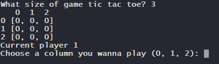
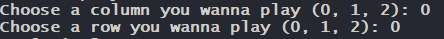

# TicTacToe
  Tic Tac Toe game for two players. Game board is defined by the players.
  ## Technologies
  - Python 
  ## Setup
  Here is the command to run the game
  
  `$ py -3.7 tictactoe.py`
  ## How to play
  Firstly you choose game size by typing number of column/rows.
  
  
  Then you're typing column and row you wanna play
  
  
  
  When the game ends there is an option to play again.
  Have fun :) 
